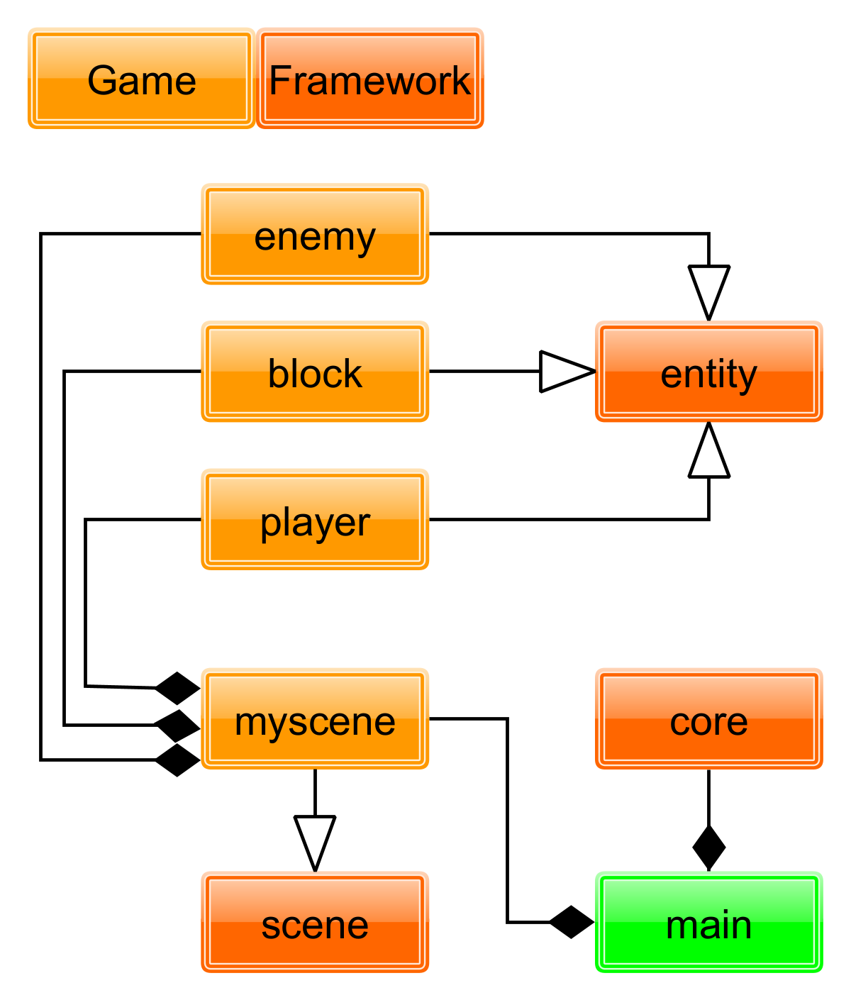

### Framework on top of Raylib using c++

### My goal :
trying to make a Brotato like game using my own Framework

 

### current Class diagram:

 

>planning on using this framework? you can donwload raylib [here](https://github.com/raysan5/raylib)