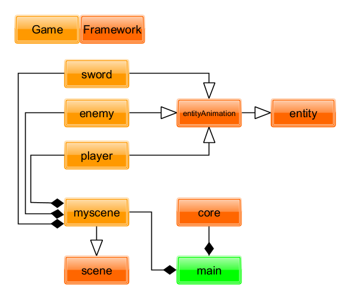

### Framework on top of Raylib using c++

### My goal :
trying to make a Brotato like game using my own Framework 
 

### Current Class Diagram:

---

## planning on using this framework?

To get started with this project, you'll need to have Raylib installed. You can download Raylib from [here](https://github.com/raysan5/raylib).
